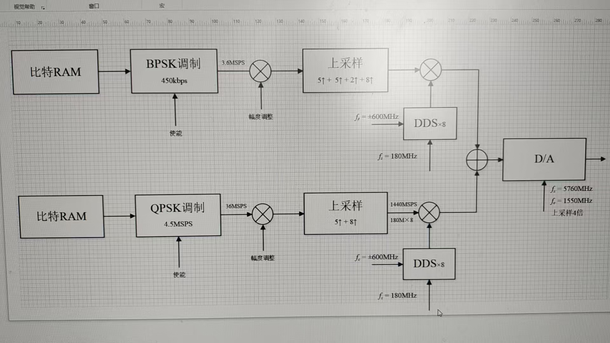

# PCIe 发射系统

## 目录结构

```
pcie-tx/
├── README.md                            # 说明文档
├── simulator_transceiver_sync_V6.pdf    # 电路版图
│
├── rtl/                                 # 发射链路 Verilog RTL
│   ├── tx_top.v                         # 发射链路顶层
│   ├── bpsk.v / qpsk.v                  # BPSK / QPSK 调制
│   ├── bpsk_mapper.v / bpsk_ram.v       # BPSK 符号映射、符号表 RAM
│   ├── qpsk_mapper.v / qpsk_ram.v       # QPSK 符号映射、符号表 RAM
│   ├── rcos_filter.v                    # 升余弦成形滤波器（另有 _iq 双路版本）
│   ├── anti_imaging_filter_5.v          # 5 倍内插抗镜像滤波器（另有 _iq 版本）
│   ├── anti_imaging_filter_8_par.v      # 8 倍内插抗镜像滤波器，多相并行（另有 _iq 版本）
│   ├── anti_imaging_filter_10.v         # 10 倍内插抗镜像滤波器
│   ├── zero_interpolator.v              # 零值内插
│   ├── dds_x8.v                         # 8 路并行 DDS，频谱搬移至中频
│   ├── digital_attenuator.v             # 数字衰减器（另有 _iq 双路版本）
│   ├── add.v                            # 8 通道 I/Q 数据逐通道求和
│   └── dpram.v                          # 双口 RAM
│
├── tb/
│   ├── tb_tx.v                          # 发射链路仿真 testbench
│   ├── tb_bpsk_rate.v                   # BPSK 双速率 / 链路选择检查
│   └── tb_bpsk_burst.v                  # BPSK 循环发 / 单次发检查
├── tcl/
│   ├── ila.tcl                          # ILA 调试脚本
│   └── vio.tcl                          # VIO 调试脚本
│
├── ps/                                  # Zynq PS 侧接口、驱动与配置
│   ├── top.vhd                          # PS 侧顶层
│   ├── ps_interface_1.vhd               # PS 接口
│   ├── arm_interface_write_1.vhd        # ARM 写接口
│   ├── pcie_tx.h                        # 发射系统寄存器地址定义（0x700 起）
│   ├── pcie_tx.c                        # 中频频点配置与发射初始化
│   ├── adhocSoft.c                      # 自组网协议栈（UDP 控制命令 case 133/134/135/136/137）
│   ├── Si5340_Data.h                    # Si5341 时钟芯片配置寄存器表
│   ├── tx_configure.py                  # 上位机 UDP 配置命令（case 133：频点/衰减/使能/速率）
│   ├── tx_start.py                      # 上位机 UDP 开播命令（case 135：单次发/循环发 + 符号数 + 起始时基）
│   ├── tx_stop.py                       # 上位机 UDP 停发命令（case 136：0x702 = 0）
│   ├── tx_status.py                     # 上位机读寄存器（case 137：读 0x71A bit0，回包给发命令的那台机器）
│   ├── tx_ram_configure.py              # 符号表分片上传（case 134，64 包）
│   └── gen_symbol_table.py              # 生成 1024 bit 分帧符号表（.bin，奇偶帧同步头）
│
├── matlab/                              # Simulink 模型与滤波器设计
│   ├── bpsk.slx / qpsk.slx              # BPSK / QPSK 链路模型
│   ├── simulink_analysis.m              # Simulink 仿真分析
│   ├── spectrum_analysis.m              # 频谱分析
│   ├── vivado_analysis.m                # Vivado 结果分析
│   ├── result.csv / sim.mat             # 仿真数据
│   ├── filter/                          # 滤波器设计文件（.fda）
│   │   ├── rcos_filter.fda              # 升余弦成形滤波器
│   │   ├── anti_imaging_filter_5.fda    # 5 倍内插抗镜像滤波器
│   │   ├── anti_imaging_filter_8.fda    # 8 倍内插抗镜像滤波器（多相）
│   │   ├── anti_imaging_filter_10.fda   # 10 倍内插抗镜像滤波器
│   │   ├── anti_aliasing_filter_5.fda   # 5 倍抽取抗混叠滤波器
│   │   ├── anti_aliasing_filter_8.fda   # 8 倍抽取抗混叠滤波器（多相）
│   │   └── anti_aliasing_filter_10.fda  # 10 倍抽取抗混叠滤波器
│   └── hdlsrc/                          # HDL Coder 生成的滤波器 RTL
│       ├── rcos_filter/                 # 每个滤波器一套：生成代码 + testbench + 编译脚本
│       ├── anti_imaging_filter_5/
│       ├── anti_imaging_filter_8/
│       └── anti_imaging_filter_10/
│
├── bootControl/                         # STM32F103 上电时序控制（STM32CubeIDE 工程）
│   ├── Core/                            # 主程序与外设初始化
│   ├── Drivers/                         # HAL 库与 CMSIS
│   ├── Middlewares/                     # FreeRTOS
│   └── gg.ioc                           # CubeMX 配置
└── imags/
    └── system-design.jpg                # 系统设计框图
```

## 一、项目源起

2026 年 8 月 19 日 18 时 29 分，老张微信问我有没有时间在家编程，于是开始了这个项目。第二天（星期四），发给我 Visio 画的框图，如下图所示。



分析：取符号、8 倍成形、多级上采样、频谱搬到中频、DA——即给叶雨阳的 PCIe 采集项目配一个发射系统。需要注意的是最后一级上采样需要多相实现。

## 二、滤波器设计

### 2.1 成形滤波

升余弦（RRC/RCOS）滤波器：

| 参数 | 取值 |
|------|------|
| 长度 | 8 个符号 |
| 截止频率 wc | 对应 1/2 符号速率的数字频率：((Rs/2)·2π) / (8·Rs) = **π/8** |
| 滚降系数 α | 0.25 |
| 成形后最高频率 | (π/8) × (1 + α) = **5π/32** |

### 2.2 上采样（抗镜像滤波器）

**5 倍内插**

| 参数 | 计算 | 取值 |
|------|------|------|
| 通带 | (5π/32) / 5 | π/32 |
| 阻带 | (2 − 5π/32) / 5 | 59π/160 |

**10 倍内插**

| 参数 | 计算 | 取值 |
|------|------|------|
| 通带 | (π/32) / 10 | π/320 |
| 阻带 | (2 − π/32) / 10 | 63π/320 |

**8 倍内插（多相实现）**

| 参数 | 计算 | 取值 |
|------|------|------|
| 通带 | (π/320) / 8 | π/2560 |
| 阻带 | (2 − π/320) / 8 | 639π/2560 |

### 2.3 下采样（抗混叠滤波器）

**8 倍抽取（多相实现）**

| 参数 | 计算 | 取值 |
|------|------|------|
| 通带 | — | π/2560 |
| 阻带 | (2 − π/320) / 8 | 639π/2560 |

**10 倍抽取**

| 参数 | 计算 | 取值 |
|------|------|------|
| 通带 | — | π/320 |
| 阻带 | (2 − π/32) / 10 | 63π/320 |

**5 倍抽取（多相实现）**

| 参数 | 计算 | 取值 |
|------|------|------|
| 通带 | — | π/32 |
| 阻带 | (2 − 5π/32) / 5 | 59π/160 |

## 三、新要求

### 3.1 修改 RAM 大小

最初的要求是 BPSK 在 450k 速率下至少连续发 1 s：450k × 1 s 向上取到 2 的幂 = 2^19 =
524288 个符号，BPSK 每符号 1 bit，即 512 Kbit = 32768 字 × 16 bit。**现 BPSK 表加大到
512 KB**（262144 字 × 16 bit = 4 Mbit），是上一次的 8 倍，见 `rtl/bpsk_ram.v`：

| 表 | 字数 | 容量 | 分片 | 连发时长 |
|----|------|------|------|----------|
| BPSK | 262144 (2^18) | 4 Mbit = 512 KB | 512 包 | 450k: **9.32 s**，400k: **10.49 s** |
| QPSK | 32768 (2^15) | 512 Kbit = 64 KB | 64 包 | 4.5m: 58.2 ms，6.667m: 39.3 ms |

> QPSK 这次**没有改**，仍是 32768 字 / 15 位写地址。两张表的字数、写地址位宽、分片数
> 现在**都不一样**，改动时别连带把 QPSK 一起改了。

表内容不再固化、也不由板上生成，改为**上位机经网口写入**（`rtl/dpram.v` 删去
`$readmemb` 预载，`mem/ram.mem` 已删除）。

#### 表数据的来源：网口上传

**配置、灌表和开播是解耦的，顺序是先配置、再灌表、最后开播：**

```bash
python gen_symbol_table.py -o 512KB.bin --table-sel bpsk              # 1. 生成分帧表（4096 帧）
python tx_configure.py --bpsk-freq 100 --qpsk-freq 200                # 2. 配置频点/衰减/使能/速率（立即生效）
python tx_ram_configure.py --table 512KB.bin --table-sel bpsk        # 3. 灌 BPSK 表
python gen_symbol_table.py -o 64KB.bin --table-sel qpsk               #    换 QPSK 再生成（512 帧）
python tx_ram_configure.py --table 64KB.bin --table-sel qpsk         #    灌 QPSK 表
python tx_start.py --single 0                                         # 4. 开播（循环发）
python tx_stop.py                                                     # 5. 停发（不复位，时基照常走）
```

| 脚本 | 干什么 |
|------|--------|
| `ps/gen_symbol_table.py` | 生成分帧符号表文件（`.bin`，1024 bit/帧、7 bit 同步头、奇偶帧交替；**必须是 2 KB 整数倍、上限 512 KB**：`--table-sel` 满表 / `--words` / `--bytes`，支持 `512K` 后缀，种子可复现） |
| `ps/tx_configure.py` | 发 case 133：频点 / 衰减 / 使能 / 速率。**运行中直接下发、立即生效**（`tx_apply_config()`），不碰 `TX_REG_RESET`、不中断正在发的包；但**不开播、不重启** |
| `ps/tx_ram_configure.py` | 发 case 134：整表分片、每包 512 字 = 1028 字节，BPSK **512 包** / QPSK **64 包**；`--table-sel` 必填，一次一张 |
| `ps/tx_start.py` | 发 case 135：**循环发或单次发**（`--single`、`--size`）**和起始时基**（`--tsel`，见 §3.3），然后板上 `tx_start()` **开播** |
| `ps/tx_stop.py` | 发 case 136：**停发**，就一笔 `emc_write(TX_REG_RAM_EN, 0)`。不复位，时基照常走；`rd_en` 拉低会一并清掉读指针和符号计数，所以下次开播必然从第 0 个符号开始 |
| `ps/tx_status.py` | 发 case 137：**读任意寄存器并把值回包**（`--addr`，默认 `0x71A` bit0 = BPSK 发射状态，见 §3.5）；`--watch` 轮询。这是唯一会往回收包的脚本 |

`tx_configure.py` 是唯一可以**边发边改**的：频点/衰减/速率/使能都在运行时可改，改完下一拍
就生效，不需要停发。`rate_sel` 例外 —— 它同时改符号速率和 add 的截位方式，切了要重新灌表。

开播（`tx_start()`）是另一回事 —— 复位读指针到 0、应用频点衰减、开 RAM 读
使能。所以开播时写指针和读指针都是 0，表必然从第一个字开始播。板上把整表所有包**全部
收进缓冲、到齐才写 RAM**，因此丢包或中断只是表不落地，RAM 一个字都不动，重跑一遍即可。

case 134 包格式：

| 偏移 | 字段 | 类型 |
|------|------|------|
| 0 | 命令 = 134 | u8 |
| 1 | `table_sel`：0 = BPSK，1 = QPSK | u8 |
| 2..3 | `chunk_idx`，小端 u16，**包序号**（BPSK 0…511，QPSK 0…63） | u16 |
| 4..1027 | 512 个字 | 1024 B |

> 这个字段是**包序号**，不是字偏移 —— BPSK 最后一片的字偏移是 261632，u16 装不下。
> 板上按 `chunk_idx × 512` 自己换算。包长仍是 1028 字节。

表文件是 **`.bin`**（小端 u16），满表长度随 `--table-sel`：BPSK **524288 字节**
（262144 字），QPSK **65536 字节**（32768 字）。**短于满表就补 0** —— 剩余部分填零字，
所以短文件可以用来只发一段前缀，后面自然停在零符号上；补了多少会打印出来，不闷声补。
**长于满表直接报错**，不截断。字的含义：BPSK 每字 16 个符号、bit0 在前；QPSK 每字
8 个符号，每符号 2 bit，低位是 I、高位是 Q。

> 既然短文件现在会被接受，"把 64 KB 的 QPSK 表发给 BPSK"就不再报错，而是补 87.5% 的
> 零。脚本对**文件长度恰好等于另一张表**这种情况会打 WARNING 提示，但不会拦住 —— 真要
> 发一段前缀时它只是噪音，看 `padding` 那行即可。

### 帧格式（`gen_symbol_table.py`）

生成的表按 **1024 bit 一帧**分帧，帧内前 **7 bit 是同步头**，其余 1017 bit 是随机数。
两种帧交替出现，**先奇后偶**：

| 帧 | 同步头（bit 1–7，发送顺序） | 转成字 |
|----|--------------------------|--------|
| 奇帧 | `1011000` | 帧首字低 7 位 = `0x0D` |
| 偶帧 | `0100111` | 帧首字低 7 位 = `0x72` |

两个同步头互为按位取反（`1011000 ⊕ 1111111 = 0100111`），所以第 7 位同时也是帧序号的
奇偶；`0x0D + 0x72 = 0x7F`。

表是**按 LSB-first 读出的**（`dpram.v`：读端口地址低位从字的最低比特一侧取组），所以
**帧的第一个比特是帧首字的 bit0**，同步头按发送顺序从左到右填进 bit0..6。一帧 = 1024 bit
= 64 字 = 128 字节，每帧只改写首字，其余 63 字整字随机。

**文件大小必须是 2 KB 的整数倍**，即 16 帧一组。16 帧 = 8 奇 + 8 偶，所以文件必然收在偶帧
上，下次突发又从奇帧开始 —— 反复重发不会让奇偶相位漂移。不满足这个倍数直接报错退出。

```bash
python gen_symbol_table.py -o 512KB.bin --table-sel bpsk --seed 0xC0FFEE  # 4096 帧
python gen_symbol_table.py -o 64KB.bin  --table-sel qpsk --seed 0xC0FFEE  #  512 帧
python gen_symbol_table.py -o part.bin  --bytes 256K --seed 0xC0FFEE      # 2048 帧
```

`--words` / `--bytes` / `--table-sel` 三选一，`K`/`M`/`G` 后缀按 1024 进制，但**都必须是
2 KB 的整数倍**（`--words` 是 1024 的整数倍）。**上限 512 KB**（524288 字节 = 262144 字，
即 BPSK 满表）—— 再长也没地方发，所以直接报错退出，不会写出一个发不出去的文件。

> 同一个 `--seed` 生成时，短文件是长文件逐字节相同的前缀（随机流按序消费），所以
> `64KB.bin` 就是 `512KB.bin` 的前 65536 字节 —— 拿小表验完再灌大表时，前 64 KB 的
> 内容是同一份。但**补零那段不是合法帧**：零字既没有同步头也不随机，会在 RX 侧失锁。

> **使能开关**：`ps/top.vhd:4774-4784` 把 PS 与 VIO 对发射链路的控制二选一，由
> `probe_out7`（`tx_sel_vio_ps`）决定，上电默认 0 = 选 VIO，此时 PS 写的频点 / 衰减 /
> 使能**全被忽略**；而 RAM 写端口（以及 §3.3 的符号数 `sym_num`）绕过这个 mux，症状是
> "表灌进去了、就是不发射"。
> `tcl/vio.tcl` 现在默认置 1 交给 PS，**每次下完 bitstream 都要重跑**。

指针位宽：

| 指针 | 位置 | 计数对象 | 总数 | 位宽 |
|------|------|----------|------|------|
| BPSK PS 写地址 | `ps/arm_interface_write_1.vhd` | 16 bit 字 | 262144 | 18 |
| QPSK PS 写地址 | `ps/arm_interface_write_1.vhd` | 16 bit 字 | 32768 | 15 |
| BPSK 读指针 | `rtl/bpsk_ram.v` | 1 bit 符号 | 4194304 | 22 |
| BPSK 单次发符号计数 | `rtl/bpsk_ram.v` | 1 bit 符号 | 4194304 | 23 |
| QPSK 读指针 | `rtl/qpsk_ram.v` | 2 bit 符号 | 262144 | 18 |

写地址计数器靠位宽自动回绕，**必须恰好是上表的位数**（BPSK 18、QPSK 15），多一位回绕
点就翻倍、后半段越界。整表字数正好一整圈，所以每次灌表后指针必回 0。BPSK 和 QPSK 是
两个独立计数器，可以各自不同宽。

> 符号计数（§3.3）**不受读指针回绕影响**：它数的是"发出去几个符号"，所以必须比读指针
> 宽一位 —— 整表 4194304 个符号，最后一个的序号是 4194303 = 2^23-1，22 位在最后一次
> 比较时会溢出，故取 23 位。寄存器里也只放得下 23 位（高 7 位 + 低 16 位）。

### 3.2 新增一对速率

| 模式 | 符号速率 |
|------|----------|
| BPSK | 400k |
| QPSK | 6.857m |

设计（180m / Rs 即每符号占用的时钟数）：

| 模式 | 符号速率 | 180m / Rs | 分解 | 说明 |
|------|----------|-----------|------|------|
| BPSK | 450k | 400 | 8 × 5 × 10 | 现有 |
| BPSK | 400k | 450 | 9 × 5 × 10 | 改为 9 倍成形滤波 |
| QPSK | 4.5m | 40 | 8 × 5 | 现有 |
| QPSK | 6.857m | ≈ 27 | 9 × 3 | 改为 9 倍成形滤波 + 3 倍上采样，实际速率 6.667m |

两个新速率的滤波器参数见第四节。

### 3.3 BPSK 循环发 / 单次发

原来只要 `RAM_EN` 为高，BPSK 读指针就一路自增到表尾回绕、**永远循环发整张表**（450k
下一圈 9.32 s）。现在 `sym_num` 决定**一轮发多少个符号**，`single_shot` 决定数满一轮
之后干什么：**循环发**（默认）回到第 0 个符号接着下一轮，**单次发**停住、射频自然
泄放到 0。

改在 `rtl/bpsk_ram.v`：新增 `sym_num[22:0]`（一轮的符号数）和 `single_shot` 两个输入，
对 `rdata_valid` 计数，计满 `sym_num` 个就把计数和读指针一起归零（循环发）或置 `done`
并把送进 `dpram` 的读脉冲门控掉（单次发）。读指针因此是**按 `sym_num` 回卷**而不是按
表深回卷，做成 23 位、低 22 位当 `r_addr`：`sym_num` 超过表长时高位进位被截掉、整表
重复，和改动前"转满一圈回到 0"是同一个行为。**QPSK 没有这个功能**，
`rtl/qpsk_ram.v` 一个字没动。

`bpsk_ram` 这里还引出一个 1 位的发射状态 `busy`（1 = 正在发），一路送到 EMC 读译码器，
ARM 能在 `0x71A` 读回来 —— 见 **§3.5**。

寄存器（`ps/pcie_tx.h`）：

| 地址 | 名称 | 含义 |
|------|------|------|
| 0x712 | `TX_REG_BPSK_SYM_NUM_L` | `sym_num[15:0]` |
| 0x714 | `TX_REG_BPSK_SYM_NUM_H` | `sym_num[22:16]`，高 7 位，其余忽略 |
| 0x716 | `TX_REG_BPSK_SINGLE_SHOT` | bit0：0 = 循环发（默认），1 = 单次发 |
| 0x718 | `TX_REG_BPSK_TIME_SEL` | 起始时基 `time_sel`：0..1023，1024 个符号一圈，读门在时基计数走到该值时打开 |
| 0x71A | `TX_REG_BPSK_BUSY` | **只读**：bit0 = 1 正在发射，0 空闲（见 §3.5）。只有 bit0 有效，其余位读回 0 |

符号数与读指针是**两个独立计数器**：符号数 23 位（整表 4194304 个符号，见 §3.1 的位宽
表），读指针仍是 22 位。组合起来就是一张真值表：

| `single_shot` | `sym_num` | 行为 |
|---------------|-----------|------|
| 0（上电默认） | 0 | 循环发**整表**（4194304 个符号）—— 上电默认就是全 0，所以稳态与改动前完全一致 |
| 0 | N ≥ 1 | 循环发：每轮发 N 个符号，数满回到第 0 个符号接着下一轮，一直循环 |
| 1 | 0 | 一个符号都不发（也可当软件"立刻停"用） |
| 1 | N ≥ 1 | 恰好发 N 个符号，然后静默 |

> **`sym_num = 0` 两种模式含义不同**：单次发下是"不发"而不是"发 1 个"——寄存器复位
> 就是 0，宁可是个一眼能看出来的空发，也不要"忘了写符号数就发出整表"；循环发下是
> "整表"，因为循环发没有"停"这个状态，上电默认（0x712/0x714 全 0）必须还是老行为。
> `sym_num` 大于表长（4194304）时整表重复 —— 读指针低 22 位回卷、23 位计数器继续进位。

**上位机发射时序**

这几个字段原来挂在 case 133 包尾（总长 36 → 47 字节），现在整个搬到 **case 135**
（`tx_start.py`）：`bpsk_single_shot` / `bpsk_size_kb` / `bpsk_time_sel` 三段连在一起，
一条命令既是"参数"也是"开播"。case 133 只认前 36 字节，36 字节以后的字段一律忽略：

```bash
python tx_configure.py --bpsk-freq 100 --qpsk-freq 200   # 配置（立即下发，不重启）
python tx_start.py --single 1 --size 256      # 发刚灌进去的那个 256 kB 文件，然后开播
python tx_start.py --single 1 --size full     # 发满整表（512 kB = 4194304 个符号）
python tx_start.py --single 1 --size 1.953125 # 2000 字节的文件
python tx_start.py --single 0 --size 0        # 循环发整表（默认，和改动前一样）
python tx_start.py --single 0 --size 1        # 循环发：每一轮只发 1 kB，然后回到表头
python tx_start.py --tsel 500                 # 时基走到 500 才开门（详见下面 time_sel 一节）
python tx_start.py --single 1 --size 256 --tsel 500   # 三样一起给
```

`tx_configure.py` 那一条**发了就生效**（`tx_apply_config()` 直接写寄存器），不用再补一条
`tx_start.py`；`tx_start.py` 里的三个参数则都是"参数+开播"——**参数只在这次开播时起作用**，
想改就得重发一条带新参数的 `tx_start.py`（`tx_start()` 会复位，见下面 `time_sel` 一节）。

**case 135 包格式**（`tx_start.py`，总长 12 字节）：

| 偏移 | 字段 | 类型 |
|------|------|------|
| 0 | 命令 = 135 | u8 |
| 1 | `bpsk_single_shot` | u8，0 = 循环发，1 = 单次发 |
| 2..9 | `bpsk_size_kb` | double（8B，小端 IEEE-754），数据文件大小，**单位 kB（1024 进制）** |
| 10..11 | `bpsk_time_sel` | u16（2B，小端），0..1023，起始时基，见下面 `time_sel` 一节 |

**case 136 包格式**（`tx_stop.py`，总长 1 字节）：

| 偏移 | 字段 | 类型 |
|------|------|------|
| 0 | 命令 = 136 | u8 |

**这个包里没有载荷 —— 命令本身就是动作**：板上就一笔 `emc_write(TX_REG_RAM_EN, 0)`，
把 `0x702` 拉低。所以它不发"停止"参数，也不会因为字段没写完而半途生效。

停发**不复位**：`count` 和 `cnt_1024` 只由 `rst_n` 清，照常走，参考时基不受影响。两个
连带效果都是从 `rtl/bpsk_ram.v` 里 `rd_en` 拉低来的：

- 读指针 `rptr` 和符号计数 `sym_cnt` / `done` 一起被清掉，所以**下次开播必然从第 0 个
  符号开始**，不管这次停在哪儿 —— 想回到表头不需要复位（单次发也一样，见 `time_sel`
  一节第 5 点）；
- 滤波器链上已有的数据正常泄放完、DAC 的 tvalid 自己落下来（见 §3.4），所以输出是
  **渐弱静音**而不是把波形切成半截。使能位一个没动：`bpsk_en` / `qpsk_en` 保持原样，
  DDS 也照常在跑。

再想发有两条路：

```bash
python tx_stop.py                             # 停发（0x702 = 0）
python tx_start.py --single 0                 # 重开播（tx_start() 脉冲 0x700，时基从 0 重来）
```

停没停、发没发完，现在是可读的：`python tx_status.py`（`0x71A` bit0，见 **§3.5**）——
停发之后它应该是 0；单次发跑完也会自己落回 0，而 `0x702` 还是 1。

- **只写 `0x702` = 1**：一笔写、不复位，时基接着走，停多久都不影响相位。代价是开门窗口
  只有一拍宽、一圈才来一次，所以最多等一圈（1024 个符号，450k 档 2.276 ms）才恢复发数。
  本仓库里没有单独发这笔写的脚本 —— `tx_start.py` 走的是下面那条复位路径。
- **`tx_start.py`（case 135）**：`tx_start()` 里会脉冲 `0x700`，效果一样，但**时基从 0
  重新开始**，`0x718` 也重新写一遍（写的就是这条包里的 `--tsel`）—— 所以连续性靠复位的
  确定性，不靠"接着上一圈走"。

**这里给的是"数据文件有多大"，不是符号数** —— 板上自己按 BPSK 每符号 1 bit 换算，所以
"灌了多大就发多长"不用人工乘。

换算就一行（`ps/adhocSoft.c` case 135）：`sym_num = kB × 1024 × 8 = kB × 8192`。512 kB →
524288 字节 → 4194304 bit = 4194304 个符号，正好是整表一圈；`gen_symbol_table.py` 的
`--bytes 256K`（= 262144 字节）对应 `--size 256`。

> kB 按 **1024** 算，和 `gen_symbol_table.py` 的 `K/M/G` 后缀、以及 §3.1 里"整表 512 KB"
> 是同一套口径。单位是 kB 而不是字节，是因为正好能把 512 kB 的整表写成一个整数，读起来
> 和 `--bytes` / 文件大小对得上。

`--size` 收十进制、`K`/`M` 后缀或 `full`（= 512，整表）。因为字节数除以 1024 是 2 的幂
缩放、double 能精确表示，所以**任何文件长度都换算得没有误差**（2000 字节 → 1.953125 kB
→ 16000 bit，精确）。23 位符号计数器把上限卡在约 1024 kB，超了脚本直接报错；大于 512 kB
（表长）会提示"表会重复"。case 135 是**新命令，没有老包要兼容**，长度不对直接丢包
（< 12 字节）；`--tsel` 超出 0..1023 脚本直接报错，板上则钳到 1023（长度对就认，值不合法
也不空发）。case 136 只有命令字节、不看长度，短包也执行。case 133 仍然按长度补默认值
（≤ 35 字节 → `rate_sel` = 0），35 字节的老包照发不误。

> `tx_start.py --single 0` 就是**回到循环发**；循环发下 `--size` 是**每轮的符号数**，
> 不写（0）等于整表。脚本每次都把 `--size`（含默认 0）显式写进包里，所以"上次设了单次
> 发、这次忘了带参数"不会把上一次的大小留下来，而是显式回到整表。

> `time_sel` 和 `--size` / `--single` 一样，都是**开播参数**：只在这次 `tx_start.py` 里
> 生效，改它必须重发一条。它和另外两个一起在 `tx_start()` 的复位窗口里落到 `0x718`
> （第 4 步），`tx_start()` 写的是 `tx_bpsk_time_sel` 这个全局量，不再是写死的 0 —— 所以
> `--tsel` 每包都按你给的值起播，不会"上一包的校准被冲掉"。代价是**校准值不再跨包延续**：
> 不写 `--tsel` 就是 0（尽快开始），想要 500 就得每次都带上。细节见下面 `time_sel` 一节。

它落到硬件就是下面这套寄存器时序（`tx_start()`）：

```
0. 写 0x704 / 0x706 / 0x70C / 0x70E / 0x710  ← case 133 运行中直接下发（tx_apply_config()）
1. 灌表                  （已有的 case 134 流程，不变）
2. 写 0x712 / 0x714      = 每轮符号数（循环发下 0 = 整表，单次发下 0 = 不发）
3. 写 0x716              = 1（单次发）/ 0（循环发）
4. 写 0x718              = 起始时基 time_sel（0 = 尽快开始）
5. 脉冲 0x700：写 0 再写 1   ← 清读指针 rptr、符号计数器、done、时基计数器
6. 写 0x702 = 1          ← 开始发（等到时基走到 time_sel）；单次发发满 sym_num 个符号后
                           自己停，循环发数满回到第 0 个符号接着下一轮
```

停发（case 136 / `tx_stop.py`）不在上面这套时序里，就一笔：

```
7. 写 0x702 = 0          ← 停发。关门停读，**不脉冲 0x700**：count / cnt_1024 照常走，
                           时基不受影响；rptr / sym_cnt / done 被 rd_en 一起清掉
```

第 7 步之后再发有两条路：把 `0x702` 写回 1（一笔写、不复位，时基接着走，最多等一圈才重新
开门），或者重跑第 2–6 步（`tx_start.py`，会脉冲 `0x700`，时基从 0 重来，`0x718` 也按这条
包里的 `--tsel` 重新写一遍）。

第 0 步是 case 133 干的，不在这套时序里：它逐条写 DDS 频点、衰减、使能和速率，**全程不碰
`0x700`**，所以在发射过程中重发也不会打断（读指针、符号计数器、`done`、时基一个都不动）。
`tx_start()` 里再写一遍（`tx_apply_runtime_cfg()`）图的是"每次起播都从已知状态开始"，尤其是
刚上电 DDS 还没配过的时候。

包里的三个字段在进 `tx_start()` 之前就解好了（`adhocSoft.c` 的 `tx_bpsk_single_shot` /
`tx_bpsk_sym_num` / `tx_bpsk_time_sel` 全局量 —— 符号数已经是换算完的 bit 数，和
`tx_rate_sel` 一个套路）：三个都由 case 135 从包里解出来（第 1、2..9、10..11 字节）。
第 5 步复位期间由 `set_bpsk_burst()` 和 `set_bpsk_time_sel()` 落到寄存器 —— 也就是第
2、3、4 步都是在复位窗口里做的，不会踩到半字更新，时基计数器这时也被 hold 在 0，写什么
值都在前面。

要再发一次就重发一遍 case 135（或只重复 4–5 步）；改符号数就回到 2。**发完后再触发不必
复位**：`rptr` / `sym_cnt` / `done` 在 `rtl/bpsk_ram.v` 里是 `if(!rst_n || ~rd_en)` 清的，
把 `0x702` 拉低一下（case 136）再拉高，就是从第 0 个符号干净地重发一遍 —— 单次发跑完
`done` 锁住的情况也一样，不用脉冲 `0x700`。脉冲复位只是把时基也一起归零，需要"相位从头
算"时才用。

> **写的顺序有讲究**：`sym_num` 是 23 位、分两个 16 位寄存器写，**不是原子操作**。如果
> 在发射过程中写，中间那一瞬间的 `(旧高 << 16) | 新低` 可能正好等于"已发符号数 + 1"，
> 把在发的这一串提前截断。所以约定**只在 `TX_REG_RESET = 0` 期间写符号数**（复位期间
> 时钟被 hold、读脉冲根本不发，改参数绝对安全），`tx_start()` 就是在复位期间调
> `set_bpsk_burst()` 的。`single_shot` 单个 16 位写，是原子的。

`ps/top.vhd` 里这两根信号照 `ram_w_*` 的接法直连 `tx_top`（`sym_num` 绕过 VIO/PS mux，
因为只有 PS 用得上），`single_shot` 则和 `rate_sel` 一样**走那个 mux** —— 这样 VIO 模式
（上电默认）下它的值恒 0，行为与改动前完全一致，不会被上一次 PS 会话留下的 1 截断。
因此**不需要重新生成 VIO IP**，也不需要动 BD（`top.vhd` 是手写顶层）。

#### 起始时基 `time_sel`（0x718）

`time_sel` 管的是"从哪儿开始发"：`rtl/bpsk_ram.v` 里 400（450k 档）/ 450（400k 档）clk
的符号分频器再驱动一个 10 位计数器 `cnt_1024`（0..1023，1024 个符号一圈；450k 档
400 × 1024 = 409600 clk ≈ 2.276 ms，400k 档 460800 clk ≈ 2.56 ms），读门 `tx_en` 在
`cnt_1024 == time_sel` 那一刻打开，之后一直开着 —— **`rd_en`（`0x702`）拉低就立刻关门**，
和改动前一样是"停发"开关，所以暂停/恢复不用脉冲复位。

四点要注意：

1. **时基和读脉冲同一个源**：`cnt_1024` 就是被那根符号分频脉冲推着走的，所以匹配上
   `time_sel` 的那个脉冲在开门时自己没读表 —— **实际发出的第一个符号落在时基位置
   `time_sel + 1`**。从复位放开算起是第 `time_sel + 2` 个符号（第 1 个脉冲开门，第 2 个
   脉冲读表）。
2. **窗口只有一拍宽、一圈才来一次**：`cnt_1024 == time_sel` 只成立一个 clk。写晚了
   （时基已经走过这个值）就要等下一圈 —— 最多白等 1024 个符号（450k 档 2.276 ms）。
   `tx_start()` 走的是"复位期间写"这条捷径：复位放开时时基从 0 起，那时写什么值都在
   前面、不用等。运行中改 `0x718` 没有脚本 —— 这是有意的，见第 5 点。
3. **`time_sel` 没有配套的模式位**：VIO 侧没有对应的 `vio_tx` 端口，所以 `ps/top.vhd`
   里 `bpsk_time_sel_mux` 在 VIO 模式（上电默认）下恒 0，只有 PS 模式才吃 0x718 的值。
   也正因为走的是手写顶层的 mux，**不需要重新生成 VIO IP，也没动 BD**。
4. **`0x702` 拉低关门、拉高要等下一圈**：`rd_en` 一低，`tx_en` 立刻清 0（`0x702` 还是停发
   开关）；但再拉高时因为窗口只有一拍宽，要等时基**下一圈转回 `time_sel`** 才重新开门 ——
   最多白等 1024 个符号（450k 档 2.276 ms）。这条路径**不重写 `0x718`**，所以起点还是
   上一次 `tx_start.py` 写进去的那个，停发/恢复不会把它挪走。
5. **要换起点只能重跑 `tx_start.py`**：`0x718` 在 `tx_start()` 的复位窗口里写（第 4 步），
   和 `sym_num` / `single_shot` 一样是**开播参数**。早先那条"停发 → 写 `0x718` → 重发、
   全程不复位"的运行时路径（原来那条独立的起始时基命令，现已删除）已经去掉：它不脉冲
   `0x700`，靠 `count` / `cnt_1024` 不受 `rd_en` 影响来保住参考时基，代价是每次改完都要
   等时基转回来。现在统一走复位窗口 —— 起点靠复位的确定性给出（`cnt_1024` 被 hold 在 0，
   写什么值都在前面、不用等），代价是参考时基也一起归零，`time_sel` 变成"相对本次突发
   开头"的位置。
   **单次发也适用**：`rptr` / `sym_cnt` / `done` 都是 `if(!rst_n || ~rd_en)` 清的，所以把
   `0x702` 拉低再拉高就能从第 0 个符号重新发一遍，不必脉冲 `0x700` —— 但那一下**不会读新的
   `time_sel`**，起点保持不变。

`tx_start()` 里写的是 `set_bpsk_time_sel(tx_bpsk_time_sel)` —— **就是这个全局量**（早先写死
0，现在按包里的值走）。所以每条 case 135 都按自己带的 `--tsel` 起播，`--tsel 500` 重发多少遍
都是 500；不写就是 0，复位放开后第一拍就开门，等于尽快开始 —— 和改动前的默认行为对得上。

> **启动比改动前晚一个符号**：读门要花一个脉冲"开门"，而且符号分频器现在跟 `rst_n`
> （= `TX_REG_RESET`）跑、不再跟 `RAM_EN` 跑，所以从"写 `0x702` = 1"到第一个符号出去，
> 比改动前晚一个符号左右（450k 档 4.4 µs 上下），具体相位取决于 `RESET` 和 `RAM_EN`
> 两次写的间隔。稳态周期（400 / 450 clk）、"循环发一直发"、单次发的符号数都不受影响。
> **`--tsel` = 0 是最紧的一格**：窗口是复位放开后的前 400 clk（≈2.2 µs），`tx_start()` 的顺序
> 保证 `0x702` 是在复位放开后 400 clk 之内拉高的，所以第一拍就撞上窗口，不会白等一圈。
> **不要在 `0x700` 写 1 和 `0x702` 写 1 之间插别的事情**（printf、延时、等别的任务）：错过了
> 这一格就要等整整一圈（409600 clk ≈ 2.28 ms）—— 不会丢，只是白白晚这么久。`tx_start()` 里
> 这两笔之间只有两个 `emc_write`，是安全的。`--tsel` 越大余量越大：门要到第 `time_sel` 个
> 时基脉冲才开（450k 档 `time_sel` × 400 clk），500 就是约 1.1 ms 的余量，插什么都不碍事。

发完之后链路上没有残留载波：`bpsk_mapper` 在 `bit_valid` 为低时把 `pulse` 清 0，
`zero_interpolator` 没样本时输出 0，所以最后一级抗镜像滤波器的冲击响应衰减完（几个
µs）`iq` 就归零了，不需要去动 `bpsk_en`。另外这次复位**只清读指针、符号计数器和
`done`，不清 RAM 里的表**（表只有重下 bitstream 或重新灌表才会变）；DDS 走的是另一个
复位 `dds_rstn`(0x800)，所以突发之间**载波相位连续**，每次单次发的波形都一致。

本地回归：`tb/tb_bpsk_burst.v`（只实例化 `bpsk_ram` + `dpram`，`iverilog` 就能跑）

```bash
iverilog -g2005 -o /tmp/tb_bpsk_burst.vvp \
    tb/tb_bpsk_burst.v rtl/bpsk_ram.v rtl/dpram.v && vvp /tmp/tb_bpsk_burst.vvp
```

覆盖：循环发周期仍是 400/450 clk、单次发恰好 N 个（N = 0/1/3/5/4194304）、发完后读指针
冻住、重触发仍是 N 个、门控期间分频器照常走，循环发按 `sym_num` 回卷（用例 A：
`sym_num = 5` 时 4500 clk 内 10 个 `rdata_valid`、读指针 0..4 循环；用例 L：`sym_num = 7`
时回卷点是 6）、停发清计数（用例 K：`rd_en` 拉低后 `rptr`/`sym_cnt` 都是 0，再拉高从
第 0 个符号重新发），`time_sel` 的启动位置（用例 I：循环发
`time_sel = 5` 时第一个符号在 2798 clk 处；用例 J：单次发 + 400k 档 + `time_sel = 3` 时
`first_valid = 450 × 4 + 448 = 2248`），以及 `0x702` 暂停/恢复（用例 K：拉低后 3000 clk
内 0 个 `rdata_valid`、`tx_en` 为 0；拉高后要等时基转回窗口，恢复后周期仍是 400 clk）。
`tb_bpsk_rate.v` / `tb_tx.v` 在本机跑不了（缺 `cmpy_0` 等 Xilinx IP），只能保证端口接全
（都补了 `.time_sel(10'd0)` / `.bpsk_time_sel(10'd0)`），真正的回归要靠上面这个 TB。

### 3.4 DAC 数据有效（axis tvalid）

#### 问题：现有 `*_valid` 全是 `clk_enable` 的回声，不是数据有效

生成滤波器（`rcos_filter` / `anti_imaging_*`）里的 `filter_out_valid` 是这么来的：

```verilog
ce_delay <= {ce_delay[63:0], 1'b1};              // 移进去的永远是个常数
assign filter_out_valid = clk_enable & ce_delay[64];
```

它只回答"流水线走到第几拍了"，**跟输入有没有数据无关**；而 `clk_enable` 又是自由跑的
（`zero_interpolator` 的 `y_valid = slot` 同样只看分频计数器、不看 `x_valid`）。于是链路
越往后 `clk_enable` 越密，最后两级直接是每拍一次 —— 它们的 `clk_enable & ce_delay[N]`
就退化成**恒 1**，永远不落。

实测（喂一个 `din_valid` 脉冲后不再喂，观察 4000 拍）：

| 级            | 有效位    | 频率    | 停喂之后 |
|---------------|-----------|---------|----------|
| `pad_8_valid` | 81 次 @2  | 1/50    | 照旧     |
| `rcos_valid`  | 16 次 @3252 | 1/50  | 照旧     |
| `pad_5_valid` | 401 次 @2 | 1/10    | 照旧     |
| `s5_valid`    | 386 次 @152 | 1/10  | 照旧     |
| `ce_out` / `s10_valid` | 3970 次 @33 | ≡1 | 恒 1，**永不落** |

所以之前 DAC 的 `s20_axis_tvalid_0` 是钉死的 `'1'`——没有可用的数据有效可接。

#### 做法：另做一条数据有效链（不动数据通路）

- `zero_interpolator` 加一对端口 `x_data_valid` / `y_data_valid`：这一拍的数据是"真数据"
  还是"插进去的零"。它和样本一起被 `pending` 捎带（和 `pending` 并排存一份、到 slot 那拍
  和 `y` 一起打出去），所以和 `y` / `y_valid` **严格同拍**。原来的 `y_valid` 一个字没动
  —— 它是下游 FIR 的 `clk_enable`，拿数据有效去门控它会把流水线卡死。
- 每个上采样器里，每级 FIR 后面跟一个**窗口或归约**：把这级的输入数据有效按 `clk_enable`
  移进一个移位寄存器，整寄存器的"或"就是这级的输出数据有效 —— 只要滤波器里还留有真数据，
  它就为高。窗口深度 = **该滤波器抽头数 + 16**。

  深度不能照抄滤波器自己的 `ce_delay`：生成的是**逐抽头流水**（每个抽头都带
  `under_pipe`/`product_pipe`），实测冲激响应跨度比 `ce_delay` 长：

  | 滤波器 | 抽头 | `ce_delay` 声称 | 实测冲激跨度 | 本设计窗口 |
  |--------|------|-----------------|--------------|-----------|
  | `rcos_filter` / `_iq`      | 64 | 65 | 73 | 80 |
  | `rcos_400k`                | 72 | 73 | 82 | 88 |
  | `anti_imaging_filter_5(_iq/_400k)` | 14/13 | 15/14 | 21 | 30 / 29 |
  | `anti_imaging_filter_10(_400k)` | 26/25 | 27/26 | 34 | 42 / 41 |
  | `anti_imaging_3_6667k`     | 7  | 7  | 13 | 23 |
  | `anti_imaging_8_par*`      | —  | 4  | 6  | 20 |

  余量是故意的：**窗口长了只是晚几百 ns 静音，短了会把真数据削掉**。
- 最后一级的窗口输出就是各上采样器新引出的 `sig_valid`，往上：

  `upsamping_*` → `bpsk.v` / `qpsk.v` 里做速率选择后送 8 路复乘器的 `s_axis_a_tvalid`
  → 8 路 `m_axis_dout_tvalid` 相或 → 各自被 `bpsk_en` / `qpsk_en` 门控 → `tx_top` 引出
  `bpsk_sig_valid` / `qpsk_sig_valid` → `top.vhd` 里相或成 `dac_sig_valid` → DAC 的
  `s20_axis_tvalid_0`。

#### 效果与代价

- **单次发跑完，DAC 的 tvalid 会自己落下来**（各链在数据泄放干净后落低），不用去动
  `bpsk_en`。循环发时恒为高，与改动前一致。
- 纯 QPSK（`bpsk_en=0`）不会被静音：两条链的 valid 相或，各自被自己的使能门控。
- **数据通路一拍没动**：`zero_interpolator` 与四个上采样器的输出做了改动前后 A/B 逐拍比对，
  15200 拍 × 4 条链**完全相同**；复乘器 `tvalid` 从 `1'b1` 换成数据有效后，`tx_top` 的
  `iq` 在 11976 拍上**逐比特相同**（因为"数据非零时 valid 必为高"是这条链的设计性质，
  已由 TB 断言）。代价是每条链约 130 个 FF，只碰手写文件，8 个 HDL Coder 生成的文件
  一个没改。
- **一个待板上确认的点**（PG269）：RFDC 的 `s_axis_tvalid` 为低时，DAC 是输出 0 还是保持
  上一个样点。两种都安全：valid 为低时 `iq` 已经是 0（valid 落下前有几百拍真数据早已泄放
  完、复乘器算出来就是 0），所以不会有残留载波被 hold 住。
- 想用 ILA 看这两根 valid 需要重生成 IP：`u_ila_tx` 的 `probe0` 已经被 256 位的 `iq` 占满。

本地回归（不需要 Xilinx IP，`iverilog` 直接跑）：

```bash
iverilog -g2005 -o /tmp/tb_upval.vvp rtl/zero_interpolator.v rtl/upsamping_*.v \
    rtl/rcos_*.v rtl/anti_imaging_*.v tb/tb_upsampling_valid.v && vvp /tmp/tb_upval.vvp
```

四条链各喂 4 个符号再停喂，断言三条性质：**输出非零的每一拍 valid 都为高**（不丢数据，
实测 0 违反）、**输入停了 valid 必须落低**、突发期间 valid 为高。`tb/tb_tx.v` 另外在
`iq`/DAC tvalid 这个边界上查同一条性质（两链都开、循环发，valid 必须为高且不能有数据被
静音）。

### 3.5 BPSK 发射状态读回（0x71A）

#### 问题：PS 只能写，读不到发射机状态

写完 `0x702 = 1` 之后，"正在发"、"单次发已经发完自己停了（`done`）"、"还在等时基窗口
（最多 1024 个符号）"这三种情况在上位机看来一模一样 —— 没有任何寄存器能读回来。

#### 做法：`bpsk_ram` 里维护一位 `busy`，一路引到 EMC 读译码器

`rtl/bpsk_ram.v` 新增一个 1 位寄存器：

```verilog
// 发射状态：0x702（rd_en）有效就拉高；stop（单次发 done / sym_num=0）或者 rd_en 拉低就清 0。
always @(posedge clk or negedge rst_n) begin
    if(!rst_n) busy <= 1'b0;
    else       busy <= rd_en & ~stop;
end
```

`stop` 就是文件里已有的那根线（`single_shot && (done || sym_num == 0)`）。只打一拍、不组合
输出，所以没有毛刺；`rd_en` 拉低同时也会清掉 `rptr` / `sym_cnt` / `done`，**这个位落下就等于
"这一轮结束了"**。

通路（每一步都是照现有信号的样子加的）：

```
rtl/bpsk_ram.v (新 output busy) → rtl/bpsk.v (tx_busy) → rtl/tx_top.v (bpsk_tx_busy)
  → ps/top.vhd   COMPONENT tx_top + 新信号 + u_tx_top 映射
  → ps/top.vhd   component ps_interface_1 + U2 映射
  → ps/ps_interface_1.vhd  entity + component arm_interface_read_1 + U2 映射
  → ps/arm_interface_read_1.vhd  entity + 地址常量 + 两级同步 + ps_din_128M 分支
```

VHDL 里端口列表是**三份**（entity / component / instance），一个信号三处都得加，漏一处就是
端口不匹配 —— 合计 8 处 VHDL 端口编辑点 + 1 处信号声明。读地址取 **`0x71A`**，紧挨 TX 块最后
一个 `0x718`：读表与写表里都空着。TX 寄存器走 EMC 片选 1（`mem_*_1` → `U2 :
ps_interface_1`），所以读 `0x71A` 必然落到这个读译码器上。

时钟域是同一个（`tx_top` 的 `clk` 就是 `clk_128M`，读 mux 也是 `clk_128M`），两级同步是照抄
文件里其它输入的写法，不是必需。

#### 语义：它回答的是"读门开着且这一轮没发完"

| 情形 | `busy` |
|------|--------|
| `0x702 = 0`（停发） | 0 |
| 单次发，正在发 | 1（`0x702` 一拉高就是 1，见下条） |
| 单次发，发完（`done` 锁住） | **0** —— 此时 `0x702` 还是 1 |
| 单次发，`sym_num = 0`（不发） | 0 |
| 循环发 | 恒等于 `rd_en`，**没有完成沿**，只有 `0x702` 拉低才落 0 |

- **不等于"真的有波出"**：`0x702` 拉高之后、时基窗口还没到的那段（最长 1024 个符号，
  450k 档 2.276 ms）它已经是 1 了。要"真的有波"得改用 `tx_en`，一行的事。
- **单次发 `sym_num = 0` 是个例外**：`stop` 由 `sym_num == 0` 组合出来，所以 `rd_en = 1` 而
  `busy = 0` 会一直成立 —— "rd_en 有效就拉高"这条规则在这个角落不适用。
- 它也不看 `bpsk_en`：`bpsk_en = 0` 把输出静音了，`busy` 照样是 1。

#### 怎么读

板上：`tx_get_bpsk_busy()`（`ps/pcie_tx.c`，`emc_read(TX_REG_BPSK_BUSY) & 0x1`）。

上位机新增 `ps/tx_status.py`。原来自带的通用读命令 `case 7` 只把值 `xil_printf` 到串口
就完了（它从 `lwip_read` 循环里调，发送方地址没接住），脚本拿不到值，所以加了 **case 137**：

| 方向 | 字节 |
|------|------|
| 请求 | `[137, addrL, addrH]`（3 字节） |
| 回包 | `[137, addrL, addrH, valL, valH]`（5 字节） |

回包**发给发命令的那台机器**：`adhocCtrl` 的收包从 `lwip_read` 换成 `lwip_recvfrom`，把来源
存进 `adhocCtrlPeer`，`ReplyToCmdSender()` 再 `lwip_sendto` 回去。**不需要**配什么目标地址
——没走 `SendToConsole` 那条发给写死 `hostIPDef`（`192.168.1.1`）:32000 的路。

```bash
python tx_status.py                        # 读一次 0x71A bit0
python tx_status.py --watch                # 轮询到 Ctrl-C
python tx_status.py --watch --count 20     # 20 次，末尾给统计（高位次数、翻转次数）
python tx_status.py --addr 0x702           # 任意地址
```

注意：

- 一次 `emc_read` 是一笔 PL 往返事务（`recv_thread` 轮 `EMC_READ_FLAG_ADDR`），所以默认
  `--interval 0.2` 秒一次，**别在板上紧循环里猛刷**。
- **旧 bitstream 读 `0x71A` 返回 `0xAA55`**（未译码地址的兜底值），脚本会把它标出来 ——
  正好用来区分"没这个功能"和"busy = 0"。
- `case 137` 是通用的（任意地址），以后加 qpsk busy / done 直接在 `0x71A` 高位放就行，不用
  再要新命令。

#### 本地回归

`tb/tb_bpsk_burst.v` 的 DUT 就是 `bpsk_ram`，新端口加上不破坏它（命名端口连接）。新断言：

| case | 断言 |
|------|------|
| A 循环发 | `busy` 全程为 1 |
| B 单次发 5 个 | `rd_en` 后为 1，`done` 之后落 0 |
| E 单次发 `sym_num = 0` | `busy` 恒 0 |
| K `rd_en` 拉低/拉高 | `rd_en = 0` 期间为 0；拉回 1 后**立刻**为 1（不等时基窗口） |

```bash
iverilog -g2005 -o /tmp/tb_bpsk_burst.vvp tb/tb_bpsk_burst.v rtl/bpsk_ram.v rtl/dpram.v \
    && vvp /tmp/tb_bpsk_burst.vvp
```

VHDL 这条链本仓库仿真不了（缺 `rx_data_types` 包），靠人工核对三份端口列表是否一致。

## 四、新增速率的滤波器设计

### 4.1 成形滤波

升余弦（RRC/RCOS）滤波器：

| 参数           | 取值                                                        |
| -------------- | ----------------------------------------------------------- |
| 长度           | 8 个符号                                                    |
| 截止频率 wc    | 对应 1/2 符号速率的数字频率：((Rs/2)·2π) / (9·Rs) = **π/9** |
| 滚降系数 α     | 0.25                                                        |
| 成形后最高频率 | (π/9) × (1 + α) = **5π/36**                                 |

### 4.2 上采样（抗镜像滤波器）

**BPSK 400k**：成形 9 倍 → 5 倍 → 10 倍 → 8 倍并行

每符号样点数 9 → 45 → 450 → 3600，各级采样率 3.6 / 18 / 180 / 1440 MHz。

| 级 | 输入带宽 | 通带 | 阻带 |
|------|------|------|------|
| 5 倍内插 | 5π/36 | (5π/36) / 5 = **π/36** | (2π − 5π/36) / 5 = **67π/180** |
| 10 倍内插 | π/36 | (π/36) / 10 = **π/360** | (2π − π/36) / 10 = **71π/360** |
| 8 倍并行 | π/360 | (π/360) / 8 = **π/2880** | (2π − π/360) / 8 = **719π/2880** |

**QPSK 6.667m**：成形 9 倍 → 3 倍 → 8 倍并行

每符号样点数 9 → 27 → 216，各级采样率 60 / 180 / 1440 MHz。

| 级 | 输入带宽 | 通带 | 阻带 |
|------|------|------|------|
| 3 倍内插 | 5π/36 | (5π/36) / 3 = **5π/108** | (2π − 5π/36) / 3 = **67π/108** |
| 8 倍并行 | 5π/108 | (5π/108) / 8 = **5π/864** | (2π − 5π/108) / 8 = **211π/864** |

### 4.3 与现有速率的对照

| 模式 | 链路（每符号样点数） | 成形 wc | 成形后最高频率 | 末级通带 |
|------|---------------------|---------|---------------|----------|
| BPSK 450k（现有） | 8 → 40 → 400 → 3200 | π/8 | 5π/32 | π/2560 |
| QPSK 4.5m（现有） | 8 → 40 → 320 | π/8 | 5π/32 | π/256 |
| BPSK 400k（新增） | 9 → 45 → 450 → 3600 | π/9 | 5π/36 | π/2880 |
| QPSK 6.667m（新增） | 9 → 27 → 216 | π/9 | 5π/36 | 5π/864 |

## 五、采集的抽取滤波器设计

1.44g 抽到15m

| 级       | 输入带宽 | 通带 | 阻带 |
| -------- | -------- | ---- | ---- |
| 8 倍抽取 | π/96     |      | pi/8 |
| 3倍抽取  | π/12     |      | pi/3 |
| 4倍抽取  | π/4      |      | pi/4 |
